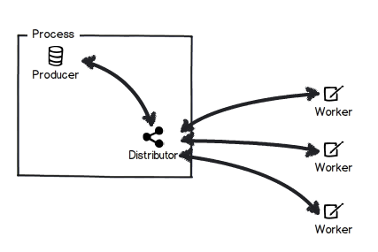

The Distributor
""""""""""""""""""""""""""""""""""""""

What is the distributor?
''''''''''''''''''''''''
The Distributor in MassTransit provides the ability to allocate work across
multiple workers when using MSMQ. This would be similar to using completing
consumers with other transports, such as RabbitMQ. If you are not using MSMQ,
the distributor is not suggested for use. 

The distributor works by consuming the message (`TMessage`) that the workers 
will be consuming, checking to see if a worker is free, then sending 
a `Distributed<TMessage>` message directly to the worker. This is done 
within MassTransit, so you are just required to register your configuration
and the rest is taken managed by MassTransit.

How do I set up the producer?
'''''''''''''''''''''''''''''

When configuring the bus, use `UseDistributorFor<TMessage>()` per the example below...

.. sourcecode:: csharp
    Bus.Initialize(x => 
    {
        x.ReceiveFrom("msmq://localhost/producer_queue");
        x.UseMsmq(mq => mq.UseMulticastSubscriptionClient()); 
        x.UseDistributorFor<MyMessageType>(); 
        x.UseControlBus();
    });

Replace `MyMessageType` with the message you want distributed across your workers.

How do I set up workers?
''''''''''''''''''''''''

The configuration for workers is similar, 
`ImplementDistributorWorker<TMessage>(consumerFactory)`. The consumer factory 
should return an action for consuming message, if apporiate. 

How can I alter the scheduling algo in use? Can I alter it at all?
''''''''''''''''''''''''''''''''''''''''''''''''''''''''''''''''''

The default scheduling is not configuratable, but implementing a 
`IWorkerSelectionStrategy` interface and registering it with the Producer 
will allow you to use your own

Does the distributor only schedule inside of a single bus, or does it work across the network?
''''''''''''''''''''''''''''''''''''''''''''''''''''''''''''''''''''''''''''''''''''''''''''''

Distributed messages are intercepted at the source bus, and distributed to the workers from there.

Can I use the distributor as a router inside of a service bus that would serve similar to a gateway/message broker?
'''''''''''''''''''''''''''''''''''''''''''''''''''''''''''''''''''''''''''''''''''''''''''''''''''''''''''''''''''''

In theory yes. 
`Content based routing <http://www.enterpriseintegrationpatterns.com/ContentBasedRouter.html>`_
can be supported with the `IWorkerSelectionStrategy`, however, we suggest that
implementors consider not using this for content based routing.
