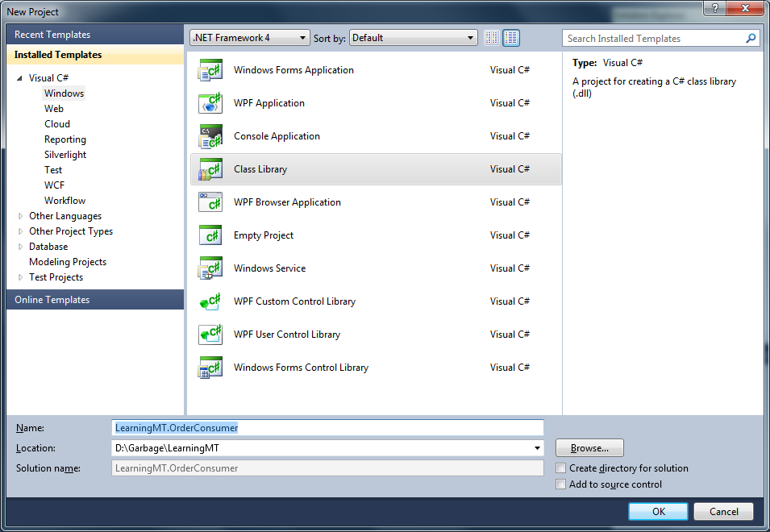
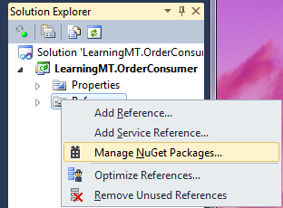
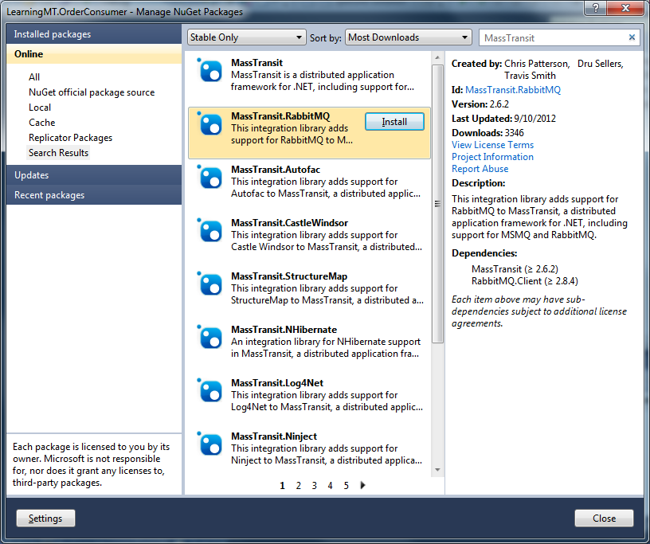
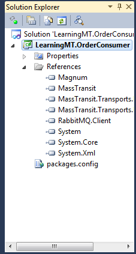
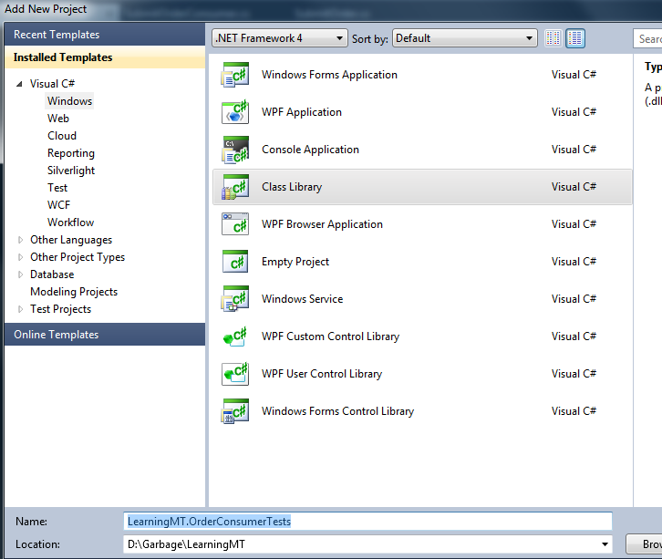

Creating Your First Consumer
============================

To create your first consumer, create a new project using Visual Studio. The project should be configured to use .NET 4.0, and should be created as a class library. In this exercise, the project name is "LearningMT.OrderConsumer".

Once the project is created, delete the Class1.cs file which was automatically created.

A reference to MassTransit must now be added, which you will do using the NuGet package manager. To add the reference, right-click on the project References and select *Manage NuGet Packages* from the context menu.

Select the *Online* section on the left, and enter *MassTransit* into the search box. Once the results are displayed, select the *MassTransit.RabbitMQ* package and click Install. This will install the RabbitMQ transport, and its dependencies, which include MassTransit itself. You many have to click the license acceptance box to continue.

Once the package manager is finished downloading the package and adding the references, close the package manager and verify that the references have been added to your project. *Note that some unneeded references added by Visual Studio have been removed.*

Adding the Message Contract
---------------------------

Using MassTransit, there are several ways that message subscriptions can be added to a service bus instance. In this exercise, you will be creating a message *consumer*. Other types of message subscriptions include message *handlers*, consumer *instances*, and *sagas*.

Before creating your consumer, however, you must first define a message. Using MassTransit, messages should be defined using C# interfaces. To create a message, add a new interface to the project called *SubmitOrder*.

.. sourcecode:: csharp
    :linenos:

    using System;
    using MassTransit;

    public interface SubmitOrder :
        CorrelatedBy<Guid>
    {
        DateTime SubmitDate { get; }
        string CustomerNumber { get; }
        string OrderNumber { get; }
    }

The interface defines the message contract that the consumer accepts. In this exercise, you are creating a service that accepts the *SubmitOrder* command. Command message contracts are defined and owned by the service and specify the input requirements for the service.

The properties on the interface are defined with getters only, because message contents are *immutable*. The interface extends the CorrelatedBy interface, specifying that a Guid should be used for message correlation. Correlation allows the message to be tracked from the message produder to the message consumer.

Adding the Consumer Class
-------------------------

A consumer in MassTransit is a class that implements one or more **Consumes** interfaces. To create the consumer, add a new class to the project called *SubmitOrderConsumer* as shown.

.. sourcecode:: csharp
    :linenos:

    using MassTransit;

    public class SubmitOrderConsumer :
        Consumes<SubmitOrder>.Context
    {
        public void Consume(IConsumeContext<SubmitOrder> context)
        {
        }
    }

The Consume method is defined by the Consumes<SubmitOrder>.Context interface, and is used by MassTransit to identify the message type for the consumer. At this point, the consumer has no behavior, but has enough code to continue the exercise.

Creating a Service Bus Instance
-------------------------------

With the consumer class created above, you are now ready to subscribe that consumer to an instance of a MassTransit service bus. However, you must first create a service to host the service bus.

Create a new class in the same project called *OrderService* as shown below.

.. sourcecode:: csharp
    :linenos:

    using MassTransit;

    public class OrderService
    {
        IServiceBus _bus;

        public void Start()
        {
            _bus = ServiceBusFactory.New(x =>
                {
                    x.UseRabbitMq();
                    x.ReceiveFrom("rabbitmq://localhost/learningmt_orderservice");
                });
        }

        public void Stop()
        {
            _bus.Dispose();
        }
    }

In the class above, two methods have been added, *Start* and *Stop*. In the Start method, the *ServiceBusFactory* is used to configure an instance of the service bus, which includes specifying the input queue for the bus instance. The Stop method disposes of the bus instance, which is necessary to ensure that all pending subscriber threads have completed.

Testing the Service Bus Instance
--------------------------------

At this point, there is a lot of code written and no unit tests. To fix that, create another project in the solution called LearningMT.OrderConsumerTests. Once created, use the NuGet Package Manager to add NUnit to the project.  (If you are running Visual Studio 2012/13, you may want to NuGet "NUnit TestAdapter including NUnit...framework" instead.) Then add a reference to your LearningMT.OrderConsumer project. Finally, NuGet "MassTransit.RabbitMQ" (which includes MassTransit) like you did for the original OrderConsumer project.  

After creating the tests project, create a new unit test (e.g., copy the following in to a new class), build the project, and then click/run "Should_create_the_service_bus" in the Test Explorer window to verify the OrderService can be started and stopped. (This will ensure that your project and dependencies are all setup correctly and that RabbitMQ is installed and configured properly as well.)  Basic unit test code is shown below.

.. sourcecode:: csharp
    :linenos:

    using NUnit.Framework;
    using OrderConsumer;

    [TestFixture]
    public class Starting_an_order_service
    {
        OrderService _orderService;

        [TestFixtureSetUp]
        public void Before()
        {
            var orderService = new OrderService();
            orderService.Start();

            _orderService = orderService;
        }

        [TestFixtureTearDown]
        public void Finally()
        {
            if(_orderService != null)
            {
                _orderService.Stop();
                _orderService = null;
            }
        }

        [Test]
        public void Should_create_the_service_bus()
        {
        }
    }
   
The test fixture setup and teardown code manage the creation, starting, and stopping of the service. The unit test itself is empty since this test is only verifying that the bus can be created.

