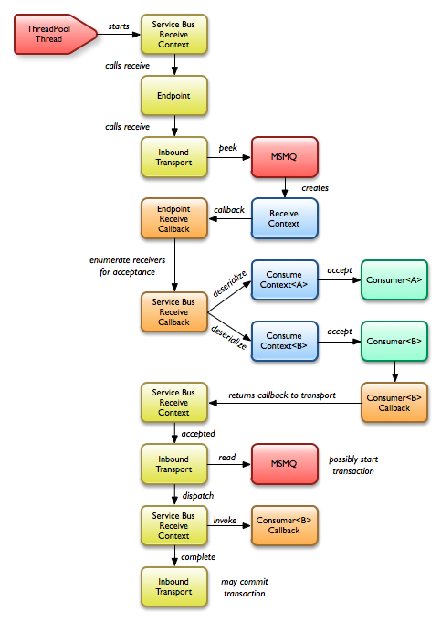

Inbound message processing pipeline
===================================

There are a lot of moving parts in MassTransit to receive a chunk of text from a queue, deserialize
the text into a message object, dispatch that message to one or more receivers, and finally
acknowledge the message on the queue. The diagram below shows the path a message takes from the
transport all the way up to the receiver.

