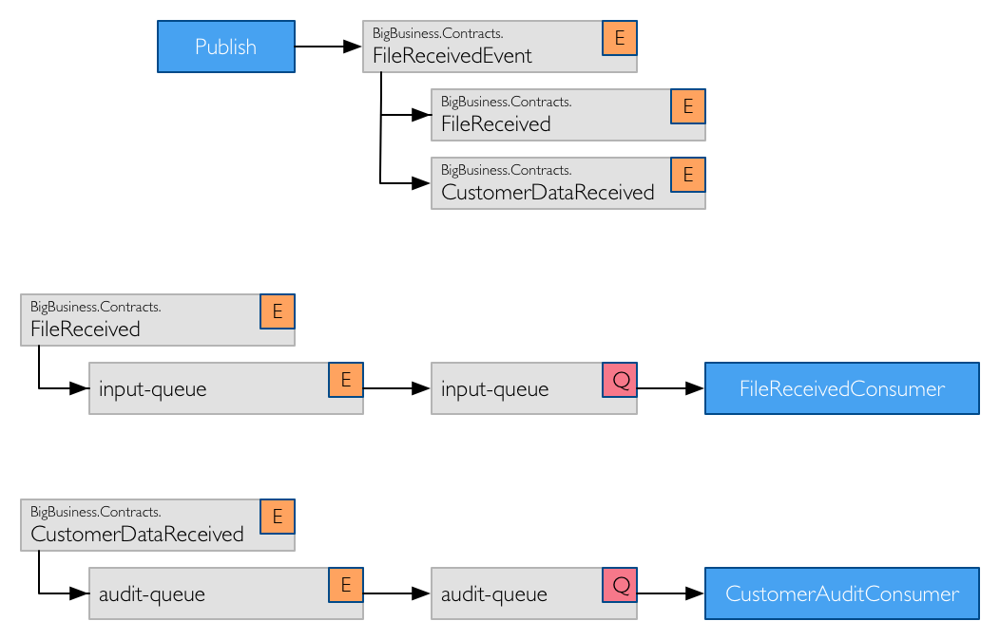
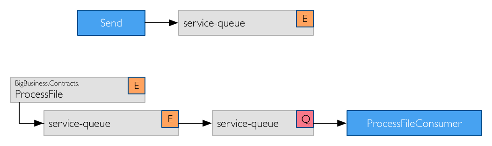

# Default Topology Conventions

In this example topology, two commands and events are used.

First, the event contracts that are supported by an endpoint that receives files from a customer.

```csharp
interface FileReceived
{
    Guid FileId { get; }
    DateTime Timestamp { get; }
    Uri Location { get; }
}

interface CustomerDataReceived
{
    DateTime Timestamp { get; }
    string CustomerId { get; }
    string SourceAddress { get; }
    Uri Location { get; }
}
```

Second, the command contract for processing a file that was received.

```csharp
interface ProcessFile
{
    Guid FileId { get; }
    Uri Location { get; }
}
```

The above contracts are used by the consumers to receive messages. From a publishing or sending perspective, two classes are created by the event producer and the command sender which implement these interfaces.

```csharp
class FileReceivedEvent :
    FileReceived,
    CustomerDataReceived
{
    public Guid FileId { get; set; }
    public DateTime Timestamp { get; set; }
    public Uri Location { get; set; }
    public string CustomerId { get; set; }
    public string SourceAddress { get; set; }
}
```

And the command class.

```csharp
class ProcessFileCommand :
    ProcessFile
{
    public Guid FileId { get; set; }   
    public Uri Location { get; set; }
}
```

The consumers for these message contracts are as below.

```csharp
class FileReceivedConsumer :
    IConsumer<FileReceived>
{
}

class CustomerAuditConsumer :
    IConsumer<CustomerDataReceived>
{
}

class ProcessFileConsumer :
    IConsumer<ProcessFile>
{
}
```


## RabbitMQ

### Publish

The exchanges and queues configures for the event example are as follows:



### Send

The exchanges and queues for the send example are shown.



> Note that the broker topology can now be configured using the [topology](../advanced/topology/README.md) API.
