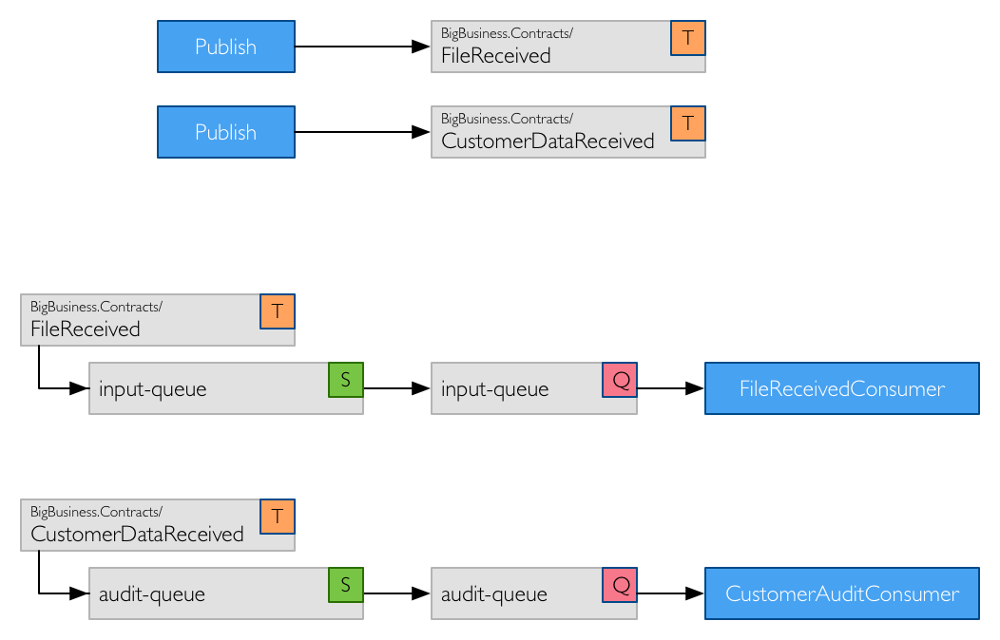
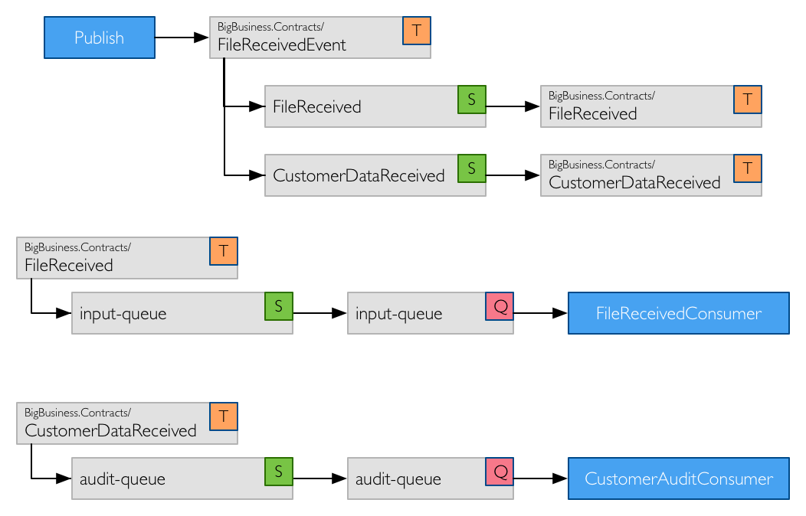

# Default Topology Conventions

In this example topology, two commands and events are used.

First, the event contracts that are supported by an endpoint that receives files from a customer.

```csharp
interface FileReceived
{
    Guid FileId { get; }
    DateTime Timestamp { get; }
    Uri Location { get; }
}

interface CustomerDataReceived
{
    DateTime Timestamp { get; }
    string CustomerId { get; }
    string SourceAddress { get; }
    Uri Location { get; }
}
```

Second, the command contract for processing a file that was received.

```csharp
interface ProcessFile
{
    Guid FileId { get; }
    Uri Location { get; }
}
```

The above contracts are used by the consumers to receive messages. From a publishing or sending perspective, two classes are created by the event producer and the command sender which implement these interfaces.

```csharp
class FileReceivedEvent :
    FileReceived,
    CustomerDataReceived
{
    public Guid FileId { get; set; }
    public DateTime Timestamp { get; set; }
    public Uri Location { get; set; }
    public string CustomerId { get; set; }
    public string SourceAddress { get; set; }
}
```

And the command class.

```csharp
class ProcessFileCommand :
    ProcessFile
{
    public Guid FileId { get; set; }   
    public Uri Location { get; set; }
}
```

The consumers for these message contracts are as below.

```csharp
class FileReceivedConsumer :
    IConsumer<FileReceived>
{
}

class CustomerAuditConsumer :
    IConsumer<CustomerDataReceived>
{
}

class ProcessFileConsumer :
    IConsumer<ProcessFile>
{
}
```


## RabbitMQ

### Publish


The event publisher, upon publishing a message, ensures that:

- An exchange named `BigBusiness.Contracts.FileReceivedEvent` is declared, matching the class name being published.
- An exchange named `BigBusiness.Contracts.FileReceived` is declared, matching the interface name implemented by the `FileReceivedEvent` class.
  - An exchange binding between the `BigBusiness.Contracts.FileReceivedEvent` exchange and the `BigBusiness.Contracts.FileReceived` exchange is declared.
- An exchange named `BigBusiness.Contracts.CustomerDataReceived` is declared, matching the interface name implemented by the `FileReceivedEvent` class.
  - An exchange binding between the `BigBusiness.Contracts.FileReceivedEvent` exchange and the `BigBusiness.Contracts.CustomerDataReceived` exchange is declared.

The receive endpoint on the `input-queue`, when the bus is started, ensures that:

- An exchanged named `input-queue` is declared, matching the queue name.
- A queue named `input-queue` is declared.
  - A queue binding between the `input-queue` exchange and the `input-queue` queue is declared.
- An exchange named `BigBusiness.Contracts.FileReceived` is declared, matching the interface name consumed by the `FileReceivedConsumer` class.
  - An exchange binding between the `BigBusiness.Contracts.FileReceived` exchange and the `input-queue` exchange is declared.

The receive endpoint on the `audit-queue`, when the bus is started, ensures that:

- An exchanged named `audit-queue` is declared, matching the queue name.
- A queue named `audit-queue` is declared.
  - A queue binding between the `audit-queue` exchange and the `audit-queue` queue is declared.
- An exchange named `BigBusiness.Contracts.CustomerDataReceived` is declared, matching the interface name consumed by the `CustomerAuditConsumer` class.
  - An exchange binding between the `BigBusiness.Contracts.CustomerDataReceived` exchange and the `audit-queue` exchange is declared.

<div class="alert alert-info">
<b>Note:</b>
    All declared exchanges are Fanout by default.
</div>

<div class="alert alert-info">
<b>Important!:</b>
If a message is published before bus containing the receive endpoint is started, the receive endpoint topology will not have been created. Without the consumer end of the topology, messages sent to the exchange will disappear as there are no bindings in place. If you need to guarantee the published message is delivered, consider setting `Mandatory` to true on the `RabbitMqSendContext`. This will throw an exception if a message is published and there are no exchange bindings in place.
</div>

### Send


The command sender, upon sending a message, ensures that:

- An exchange named `service-queue` is declared, matching the name in the endpoint address.

The receive endpoint on the `service-queue`, when the bus is started, ensures that:

- An exchanged named `service-queue` is declared, matching the queue name.
- A queue named `service-queue` is declared.
  - A queue binding between the `service-queue` exchange and the `service-queue` queue is declared.
- An exchange named `BigBusiness.Contracts.ProcessFile` is declared, matching the interface name consumed by the `ProcessFileConsumer` class.
  - An exchange binding between the `BigBusiness.Contracts.ProcessFile` exchange and the `service-queue` exchange is declared.

<div class="alert alert-info">
<b>Important!:</b>
The same rule for publish applies to send, if the consumer topology isn't setup by the receive endpoint, messages will disappear.
</div>

## Azure Service Bus

### Publish



The event publisher, upon publishing a message, ensures that:

- A topic named `BigBusiness.Contracts.FileReceived` is created, matching the interface name implemented by the `FileReceivedEvent` class.
- A topic named `BigBusiness.Contracts.CustomerDataReceived` is created, matching the interface name implemented by the `FileReceivedEvent` class.

The receive endpoint on the `input-queue`, when the bus is started, ensures that:

- A queue named `input-queue` is created.
- A topic named `BigBusiness.Contracts.FileReceived` is created, matching the interface name consumed by the `FileReceivedConsumer` class.
  - A subscription on the `BigBusiness.Contracts.FileReceived` topic, which forwards to the `input-queue` queue is created.

The receive endpoint on the `audit-queue`, when the bus is started, ensures that:

- A queue named `audit-queue` is created.
- A topic named `BigBusiness.Contracts.CustomerDataReceived` is created, matching the interface name consumed by the `CustomerAuditConsumer` class.
  - A subscription on the `BigBusiness.Contracts.CustomerDataReceived` topic, which forwards to the `audit-queue` queue is created.

<div class="alert alert-info">
<b>Important!:</b>
If a message is published before bus containing the receive endpoint is started, the receive endpoint topology will not have been created. Without the consumer end of the topology, messages sent to the exchange will disappear as there are no subscriptions in place.
</div>

### Send


The command sender, upon sending a message, ensures that:

- A queue named `service-queue` is created, matching the name in the endpoint address.

The receive endpoint on the `service-queue`, when the bus is started, ensures that:

- A queue named `service-queue` is created.
- A topic named `BigBusiness.Contracts.ProcessFile` is created, matching the interface name consumed by the `ProcessFileConsumer` class.
  - A subscription on the `BigBusiness.Contracts.ProcessFile` topic, which forwards to the `service-queue` queue is created.

<div class="alert alert-info">
<b>Important!:</b>
The same rule for publish applies to send, if the consumer topology isn't setup by the receive endpoint, messages will disappear.
</div>div>


### Sneak Peak - Publish

In an upcoming release of MassTransit, the same polymorphic behavior of RabbitMQ will also be supported by Azure Service Bus, as shown below.




